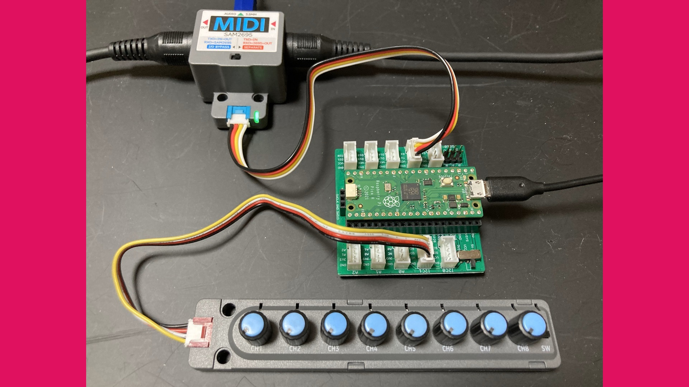

MIDI Controller PRMC-1
======================

MIDI Controller using PicoRuby/R2P2 by ISGK Instruments (Ryo Ishigaki)

https://github.com/risgk/midi-controller-prmc-1

PRMC-1 (type-0)
---------------

- See [Making a MIDI controller device with PicoRuby/R2P2 (RubyKaigi 2025 LT)](https://speakerdeck.com/risgk/r2p2-rubykaigi-2025-lt)
- Required Software: R2P2 0.3.0
- Required Hardware: Raspberry Pi Pico, Grove Shield for Pi Pico, M5Stack Unit 8Angle, M5Stack Unit MIDI

PRMC-1 (type-1)
---------------

- Same features as PRMC-1 (type-0)
- Required Software: R2P2_PICO 0.4.1, mruby compiler 3.3.0
- Required Hardware: Raspberry Pi Pico, Grove Shield for Pi Pico, M5Stack Unit 8Angle, M5Stack Unit MIDI
